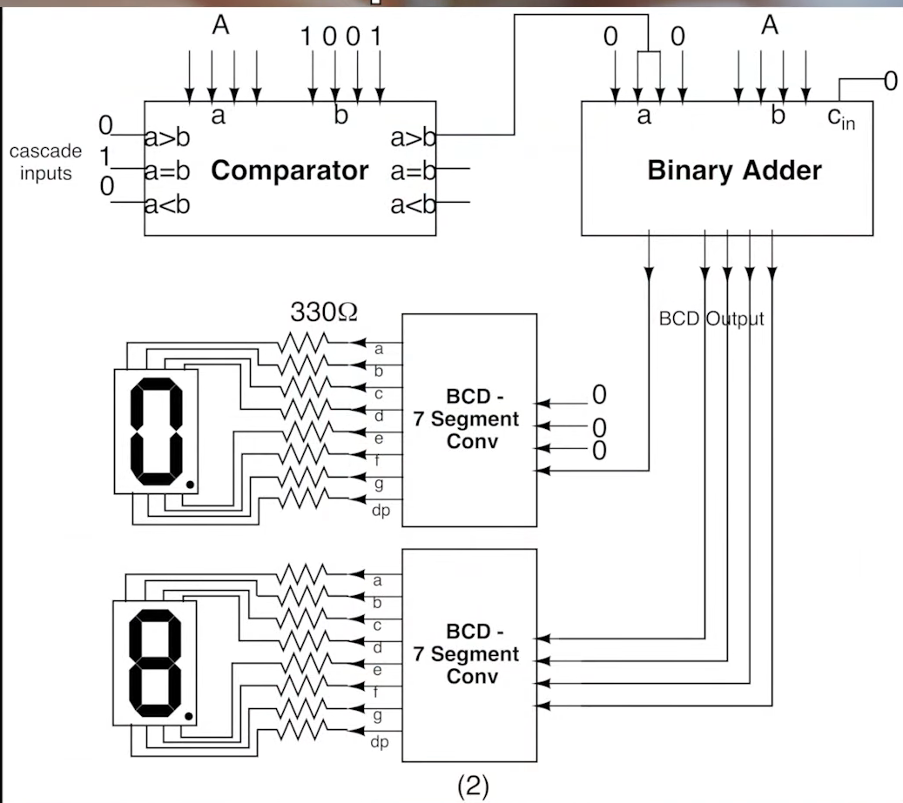
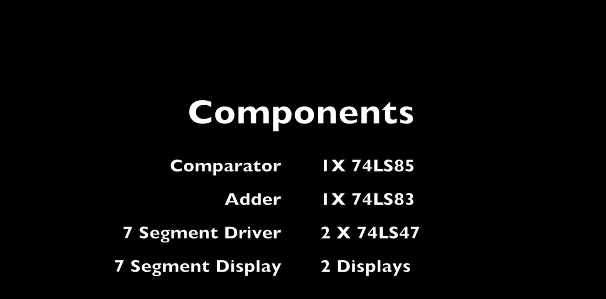
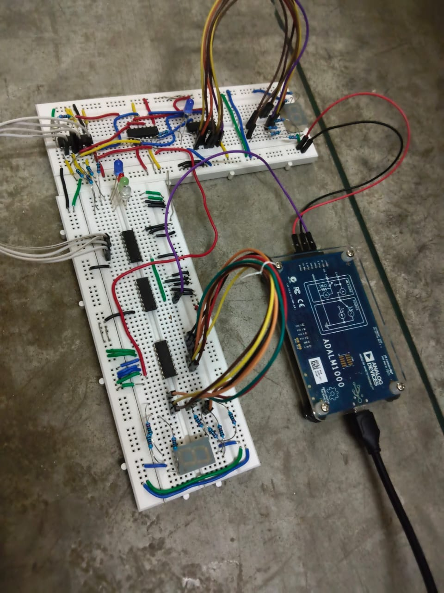
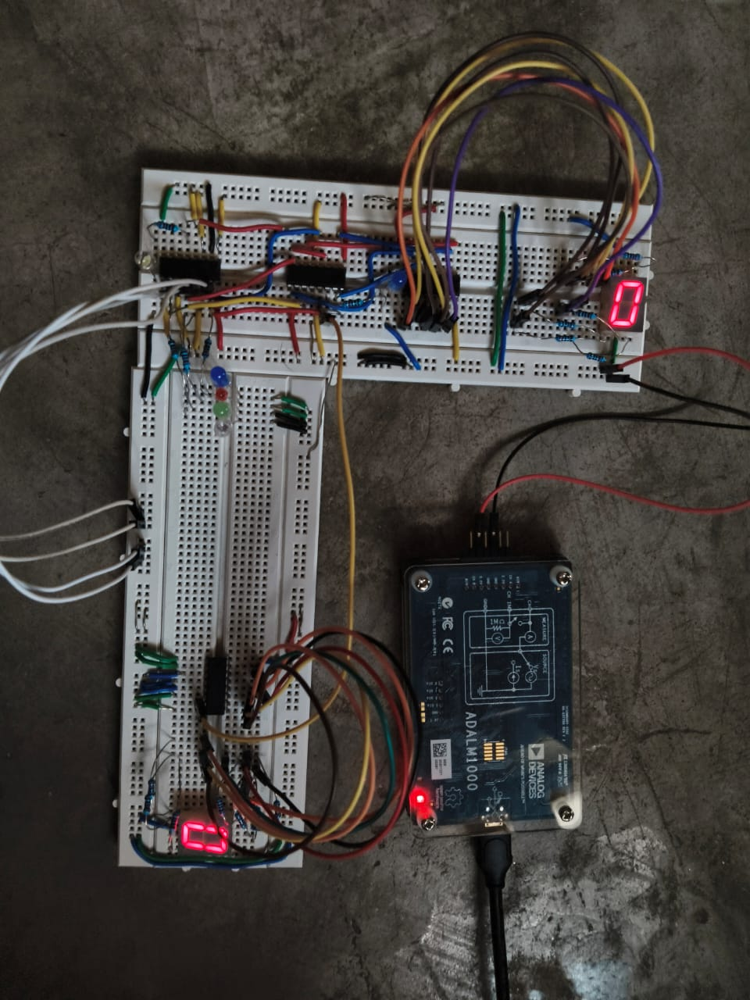
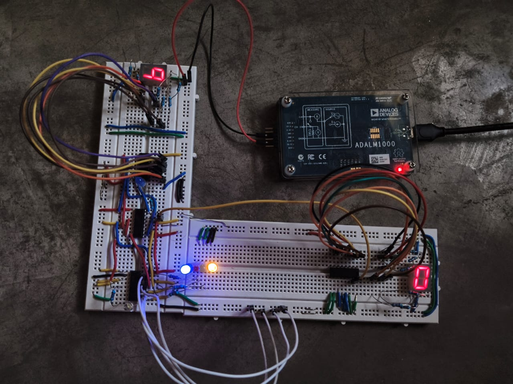
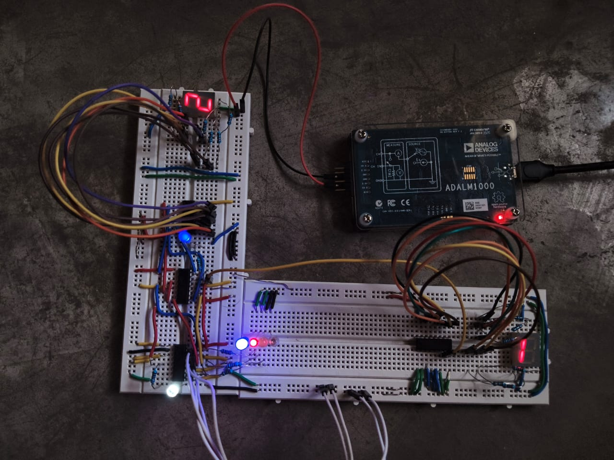
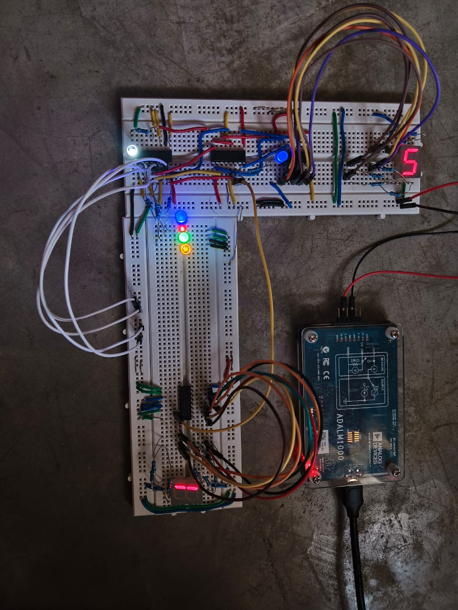
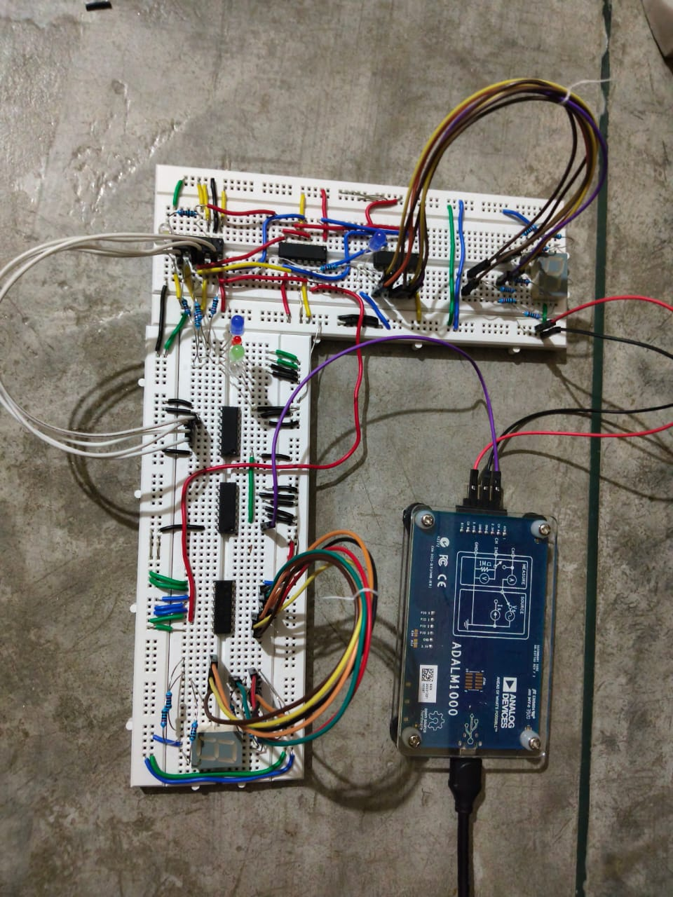

# Binary to Decimal Display System

A complete digital electronics hardware project demonstrating the design, implementation, and testing of a 4-bit Binary to Decimal Display System using standard TTL Logic ICs.

The system accepts a 4-bit binary input (0000–1111) and displays its corresponding decimal value (0–15) on two common-anode 7-segment displays.

---

## Project Objectives

* Design a hardware-based Binary to Decimal Display System
* Convert 4-bit binary numbers into decimal representation
* Implement BCD correction using TTL logic
* Interface common-anode seven-segment displays
* Verify operation through practical hardware implementation

---

## System Architecture

The system uses a 74LS85 comparator to determine whether the binary input exceeds decimal 9. When required, a 74LS83 binary adder performs BCD correction. The corrected BCD data is decoded by two 74LS47 display drivers and displayed on two common-anode seven-segment displays.

---

## Components Used

### Digital Logic ICs

* 74LS85 – 4-Bit Magnitude Comparator
* 74LS83 – 4-Bit Binary Full Adder
* 74LS47 ×2 – BCD to Seven Segment Decoder Driver
* SN74LS163 – Synchronous Binary Counter
* CD40106 – Schmitt Trigger Inverter

### Other Components

* Two Common Anode Seven Segment Displays
* Breadboard
* Toggle Switches
* 330 Ω Resistors
* ADALM1000 Power Source
* Jumper Wires

---

## Working Principle

### Manual Mode

The binary input is applied using toggle switches.

The 74LS85 compares the input against decimal 9.

When the input exceeds 9, the comparator enables the 74LS83 adder to add the required BCD correction value.

The corrected BCD output is decoded by two 74LS47 ICs and displayed as a decimal number.

### Automatic Mode

An SN74LS163 synchronous counter automatically generates binary counts.

A clock generated using a CD40106 Schmitt Trigger continuously advances the count from 0000 to 1111.

The display system converts each binary value into its corresponding decimal output.

---

## Breadboard Implementation

Complete hardware implementation using TTL Logic ICs.

---

## Manual Testing Results

### Decimal 0

### Decimal 9

### Decimal 12

### Decimal 15

The circuit was tested for all binary combinations from 0000 to 1111.

---

## Automatic Counter Demonstration

The SN74LS163 counter automatically generates binary counts while the display system continuously converts them into decimal outputs.

---

## Demonstration Videos

### Manual Binary to Decimal Display

https://youtu.be/X1XSMR6EOH0

### Automatic Counter Demonstration

https://youtu.be/ftOyYPs8k7s

---

## Repository Structure

images/
├── reference/
│   ├── block_diagram.png
│   └── components_used.png
│
├── hardware/
│   └── complete_breadboard.jpeg
│
├── manual_operation/
│   ├── decimal_0.jpeg
│   ├── decimal_9.jpeg
│   ├── decimal_12.jpeg
│   └── decimal_15.jpeg
│
└── automatic_operation/
    └── automatic_view_1.jpeg

---

## Key Learning Outcomes

* TTL Digital Logic Design
* Binary to Decimal Conversion
* Binary Coded Decimal (BCD)
* Magnitude Comparison
* Binary Addition
* Seven Segment Display Interfacing
* Breadboard Circuit Construction
* Hardware Debugging
* System Verification

---

## Author

**Aditya Ojha**

B.S. Electronic Systems  
Indian Institute of Technology Madras

B.Tech Electronics & Telecommunication Engineering  
Jabalpur Engineering College
